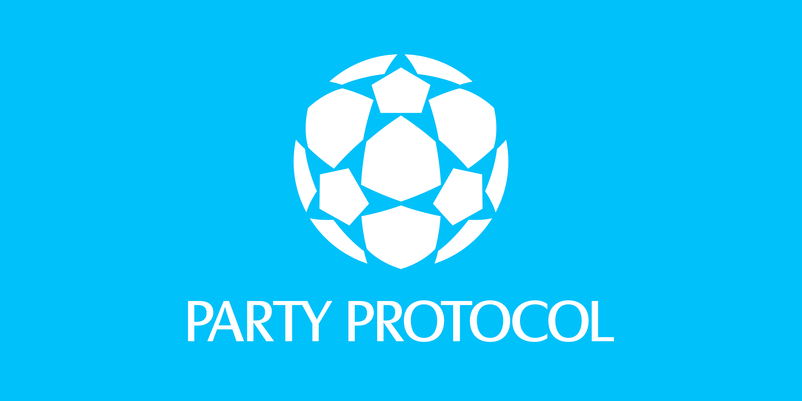

[![Version][version-badge]][version-link]
[![License][license-badge]][license-link]
[![Test][ci-badge]][ci-link]
[![Docs][docs-badge]][docs-link]
[![Discussions][discussions-badge]][discussions-link]
[![Discord][discord-badge]][discord-link]

[version-badge]: https://img.shields.io/github/release/PartyDAO/party-protocol?label=version
[version-link]: https://github.com/PartyDAO/party-protocol/releases
[license-badge]: https://img.shields.io/github/license/PartyDAO/party-protocol
[license-link]: https://github.com/PartyDAO/party-protocol/blob/main/LICENSE
[ci-badge]: https://github.com/PartyDAO/party-protocol/actions/workflows/ci.yml/badge.svg
[ci-link]: https://github.com/PartyDAO/party-protocol/actions/workflows/ci.yml
[docs-badge]: https://img.shields.io/badge/Party-documentation-informational
[docs-link]: https://github.com/PartyDAO/party-protocol/tree/main/docs
[discussions-badge]: https://img.shields.io/badge/Party-discussions-blueviolet
[discussions-link]: https://github.com/PartyDAO/party-protocol/discussions
[discord-badge]: https://img.shields.io/static/v1?logo=discord&label=discord&message=join&color=blue
[discord-link]: https://discord.gg/zUeXpDX8HA

# Party Protocol

A protocol for _group coordination_. The Party Protocol provides on-chain functionality for group formation, coordination, and distribution, with the goal of making Ethereum multiplayer.

## Table of Contents

- [Party Protocol](https://github.com/PartyDAO/party-protocol#party-protocol)
  - [Table of Contents](https://github.com/PartyDAO/party-protocol#table-of-contents)
  - [Documentation](https://github.com/PartyDAO/party-protocol#documentation)
  - [Contributing](https://github.com/PartyDAO/party-protocol#contributing)
  - [Layout](https://github.com/PartyDAO/party-protocol#layout)
  - [Deployments](https://github.com/PartyDAO/party-protocol#deployments)
  - [Install](https://github.com/PartyDAO/party-protocol#install)
  - [Testing](https://github.com/PartyDAO/party-protocol#testing)
  - [Audits](https://github.com/PartyDAO/party-protocol#audits)
  - [Bug Bounty](https://github.com/PartyDAO/party-protocol#bug-bounty)
  - [License](https://github.com/PartyDAO/party-protocol#license)

## Documentation

For more information on Party Protocol, see the documentation [here](https://docs.partydao.org).

## Contributing

This is an open protocol, so if you are interested in contributing see [here](./CONTRIBUTING.md) for more details about how you could get involved.

## Layout

```
docs/ # Start here
├── overview.md
├── crowdfund.md
└── governance.md
contracts/
│   # Used during the crowdfund phase
├── crowdfund/
├── gatekeepers/
├── globals/
│   # Used during the governance phase
├── party/
├── proposals/
├── distribution/
|   # Used to render crowdfund and governance NFTs
└── renderers/
test/ # Foundry tests
```

## Deployments

Below are the latest deployments of each contract of the Party Protocol. For addresses of previous releases, see [here](https://github.com/PartyDAO/party-addresses).

| Contract                      | Ethereum                                                                                                              | Goerli                                                                                                                       |
| ----------------------------- | --------------------------------------------------------------------------------------------------------------------- | ---------------------------------------------------------------------------------------------------------------------------- |
| `Globals`                     | [0x1ca20040ce6ad406bc2a6c89976388829e7fbade](https://etherscan.io/address/0x1ca20040ce6ad406bc2a6c89976388829e7fbade) | [0x753e22d4e112a4d8b07df9c4c578b116e3b48792](https://goerli.etherscan.io/address/0x753e22d4e112a4d8b07df9c4c578b116e3b48792) |
| `TokenDistributor`            | [0x49a3caab781f711ad74c9d2f34c3cbd835d6a608](https://etherscan.io/address/0x49a3caab781f711ad74c9d2f34c3cbd835d6a608) | [0x8714EA9C2BC5a8f2d26D7c3F86558331c16145B5](https://goerli.etherscan.io/address/0x8714EA9C2BC5a8f2d26D7c3F86558331c16145B5) |
| `ProposalExecutionEngine`     | [0xdf6a4d97dd2aa32a54b8a2b2711f210b711f28f0](https://etherscan.io/address/0xdf6a4d97dd2aa32a54b8a2b2711f210b711f28f0) | [0xc148E6f886CccdA5dEBbBA10d864d007E0C74c85](https://goerli.etherscan.io/address/0xc148E6f886CccdA5dEBbBA10d864d007E0C74c85) |
| `Party`                       | [0xb676cfeeed5c7b739452a502f1eff9ab684a56da](https://etherscan.io/address/0xb676cfeeed5c7b739452a502f1eff9ab684a56da) | [0x72a4b63eceA9465e3984CDEe1354b9CF9030c043](https://goerli.etherscan.io/address/0x72a4b63eceA9465e3984CDEe1354b9CF9030c043) |
| `PartyFactory`                | [0xc0e0ec5541e26e93d5a9f5e999ab2a0a7f8260ae](https://etherscan.io/address/0xc0e0ec5541e26e93d5a9f5e999ab2a0a7f8260ae) | [0x83e63E8bAba6C6dcb9F3F4324bEfA72AD8f43e44](https://goerli.etherscan.io/address/0x83e63E8bAba6C6dcb9F3F4324bEfA72AD8f43e44) |
| `AuctionCrowdfund`            | [0xcf8ab207e1b055871dfa9be2a0cf3acaf2d1b3a7](https://etherscan.io/address/0xcf8ab207e1b055871dfa9be2a0cf3acaf2d1b3a7) | [0x631D392073330f0573AD18Fc64305768657D0D60](https://goerli.etherscan.io/address/0x631D392073330f0573AD18Fc64305768657D0D60) |
| `RollingAuctionCrowdfund`     | [0x1b5cb8bb71eda9059d39c98348095b008b67e734](https://etherscan.io/address/0x1b5cb8bb71eda9059d39c98348095b008b67e734) | [0x989Fb364065a80d732837742f960924f343C6E04](https://goerli.etherscan.io/address/0x989Fb364065a80d732837742f960924f343C6E04) |
| `BuyCrowdfund`                | [0x104db1e49b87c80ec2e2e9716e83a304415c15ce](https://etherscan.io/address/0x104db1e49b87c80ec2e2e9716e83a304415c15ce) | [0x712Dca72Cc443A5f5e03A388b69ab09b4CDAC428](https://goerli.etherscan.io/address/0x712Dca72Cc443A5f5e03A388b69ab09b4CDAC428) |
| `CollectionBuyCrowdfund`      | [0x8ba53d174c540833d7f87e6ef97fc85d3d9291b4](https://etherscan.io/address/0x8ba53d174c540833d7f87e6ef97fc85d3d9291b4) | [0x884561d34e6B98a11DaF9Cc5d0d50cEFC664262F](https://goerli.etherscan.io/address/0x884561d34e6B98a11DaF9Cc5d0d50cEFC664262F) |
| `CollectionBatchBuyCrowdfund` | [0x05daeace2257de1633cb809e2a23387a2742535c](https://etherscan.io/address/0x05daeace2257de1633cb809e2a23387a2742535c) | [0x9926816276CFE4E7c230E14d5a8808C9709Fa51a](https://goerli.etherscan.io/address/0x9926816276CFE4E7c230E14d5a8808C9709Fa51a) |
| `CrowdfundFactory`            | [0x2e8920950677f8545b4ef80315f48e161cb02d1c](https://etherscan.io/address/0x2e8920950677f8545b4ef80315f48e161cb02d1c) | [0x5bFADA22929Ce611894c5ba0A1d583459f3f3858](https://goerli.etherscan.io/address/0x5bFADA22929Ce611894c5ba0A1d583459f3f3858) |
| `PartyNFTRenderer`            | [0x19bcac3761df79c9b242ebe6670898da7d4bdcb3](https://etherscan.io/address/0x19bcac3761df79c9b242ebe6670898da7d4bdcb3) | [0xCcBdaE221A4B5DC62B37dc2F815d773c8cF89Bb1](https://goerli.etherscan.io/address/0xCcBdaE221A4B5DC62B37dc2F815d773c8cF89Bb1) |
| `CrowdfundNFTRenderer`        | [0x0d05169e6e84bde47145b03ec2e6ba9af4d3cb7c](https://etherscan.io/address/0x0d05169e6e84bde47145b03ec2e6ba9af4d3cb7c) | [0x59A1A5669f59B128890069233cf0445840F3441D](https://goerli.etherscan.io/address/0x59A1A5669f59B128890069233cf0445840F3441D) |
| `AllowListGateKeeper`         | [0x50c58f8bd97c1845c8e8ff56117dbce8a5b009b2](https://etherscan.io/address/0x50c58f8bd97c1845c8e8ff56117dbce8a5b009b2) | [0xadcec7b4db7969dff00b9e5304be8e0d1261d6b4](https://goerli.etherscan.io/address/0xadcec7b4db7969dff00b9e5304be8e0d1261d6b4) |
| `TokenGateKeeper`             | [0x26a7bd6161e4c6ae44620cfc6f7b9c3daf83ad0b](https://etherscan.io/address/0x26a7bd6161e4c6ae44620cfc6f7b9c3daf83ad0b) | [0xa6fbce9898a34a1e6db5dab699b20b6bfefda8c3](https://goerli.etherscan.io/address/0xa6fbce9898a34a1e6db5dab699b20b6bfefda8c3) |
| `MetadataRegistry`            | [0x175487875f0318edbab54bba442ff53b36e96015](https://etherscan.io/address/0x175487875f0318edbab54bba442ff53b36e96015) | [0x59E2844F9ADb537a97011528E699f76934Ef7cc9](https://goerli.etherscan.io/address/0x59E2844F9ADb537a97011528E699f76934Ef7cc9) |
| `InitialETHCrowdfund`         | [0x23c886396cfbadb0f3bac4b728150e8a59dc0e10](https://etherscan.io/address/0x23c886396cfbadb0f3bac4b728150e8a59dc0e10) | [0xBA975083A523dAcd5918b880F29B5a99ecE83a2b](https://goerli.etherscan.io/address/0xBA975083A523dAcd5918b880F29B5a99ecE83a2b) |
| `CollectionBatchBuyOperator`  | [0x119c7ee43ebf1dedc45a3730735583bd39e32579](https://etherscan.io/address/0x119c7ee43ebf1dedc45a3730735583bd39e32579) | [0x039d2e6AEf994445b00b6B55524bAcA0B0Be78DB](https://goerli.etherscan.io/address/0x039d2e6AEf994445b00b6B55524bAcA0B0Be78DB) |
| `ERC20SwapOperator`           | [0xd9f65f0d2135bee238db9c49558632eb6030caa7](https://etherscan.io/address/0xd9f65f0d2135bee238db9c49558632eb6030caa7) | [0x88B08D166cf2779c1E2ef6C1171214E782831814](https://goerli.etherscan.io/address/0x88B08D166cf2779c1E2ef6C1171214E782831814) |

## Install

First, install [Foundry](https://book.getfoundry.sh/getting-started/installation.html).

```bash
forge install
yarn -D
yarn build
yarn build:ts
```

## Testing

### Run tests (except fork tests):

```bash
forge test -vv
# If you want gas reports:
forge test --gas-report -vv
```

### Run forked tests

```bash
forge test --mt testFork --fork-url $YOUR_RPC_URL -vv
```

### Run all tests

```bash
forge test --fork-url $YOUR_RPC_URL -vv
```

## Audits

The following auditors were engaged to review the protocol before launch:

- Code4rena (report [here](./audits/partydao-c4-report.md))
- Macro (report [here](./audits/Party-Protocol-Macro-Audit.pdf))

## Bug Bounty

All contracts except tests, interfaces, dependencies, and those in `renderers/` are in scope and eligible for the Party Protocol Bug Bounty program.

The following are known and are _not_ eligible for a bug bounty:

- Crowdfund host uses their crowdfund's balance to buy their own NFT
- Forcing a `BuyCrowdfund` or `CollectionBuyCrowdfund` to use its entire balance to acquire an NFT above its listed price
- Free or gifted NFTs being locked in a crowdfund after the crowdfund lost

The rubric we use to determine bug bounties is as follows:

| **Level**   | **Example**                                                                                                                                                                                      | **Maximum Bug Bounty** |
| ----------- | ------------------------------------------------------------------------------------------------------------------------------------------------------------------------------------------------ | ---------------------- |
| 6. Critical | - Draining or freezing of holdings protocol-wide (e.g. draining token distributor, economic attacks, reentrancy, MEV, logic errors)                                                              | Let's talk             |
| 5. Severe   | - Contracts with balances can be exploited to steal holdings under specific conditions (e.g. bypass guardrails to transfer precious NFT from parties, user can steal their party's distribution) | Up to 25 ETH           |
| 4. High     | - Contracts temporarily unable to transfer holdings<br>- Users spoof each other                                                                                                                  | Up to 10 ETH           |
| 3. Medium   | - Contract consumes unbounded gas<br>- Griefing, denial of service (i.e. attacker spends as much in gas as damage to the contract)                                                               | Up to 5 ETH            |
| 2. Low      | - Contract fails to behave as expected, but doesn't lose value                                                                                                                                   | Up to 1 ETH            |
| 1. None     | - Best practices                                                                                                                                                                                 |                        |

Any vulnerability or bug discovered must be reported only to the following email: [security@partydao.org](mailto:security@partydao.org).

## License

The primary license for the Party Protocol is the GNU General Public License 3.0 (`GPL-3.0`), see [LICENSE](./LICENSE).

- Several interface/dependencies files from other sources maintain their original license (as indicated in their SPDX header).
- All files in `test/` remain unlicensed (as indicated in their SPDX header).
