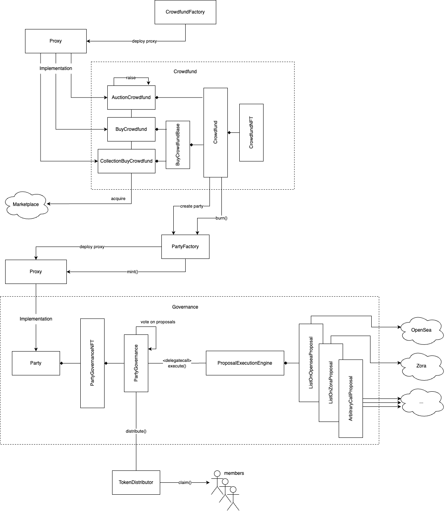

# Party Protocol

A protocol for _group coordination_. Party Protocol provides on-chain functionality for group formation, coordination, and distribution. Party Protocol allows people to pool funds together to acquire NFTs, then coordinate together to use or sell those NFTs as a group.

## Patterns

There are several code patterns that are used heavily throughout this codebase. Being familiar with them before diving into the contract will greatly help in understanding the motivation behind why certain things are done:

- The [off-chain storage](https://github.com/dragonfly-xyz/useful-solidity-patterns/tree/main/patterns/off-chain-storage) pattern is used across almost all contracts.
- The [explicit storage buckets](https://github.com/dragonfly-xyz/useful-solidity-patterns/tree/main/patterns/explicit-storage-buckets) pattern is used in both the `PartyGovernance` and `ProposalExecutionEngine` implementation.
- [Packing storage](https://github.com/dragonfly-xyz/useful-solidity-patterns/tree/main/patterns/packing-storage) pattern is used across almost all contracts to ensure not only that storage slots are packed wherever possible but also that items that are commonly accessed together (eg. `feeRecipient` and `feeBps` in `PartyGovernance`) are packed in the same slot to be retrieved in a single call.
- [Merkle proofs](https://github.com/dragonfly-xyz/useful-solidity-patterns/tree/main/patterns/merkle-proofs) are used to implement the `AllowListGateKeeper`.

## Phases

The protocol has two distinct phases that occur in this order:

- [Crowdfund](./crowdfund.md)
  - Where contributors pool together ETH to acquire an NFT.
- [Governance](./governance.md)
  - Where contributors govern an NFT (typically acquired by a crowdfund).

## Protocol Lifecycle

