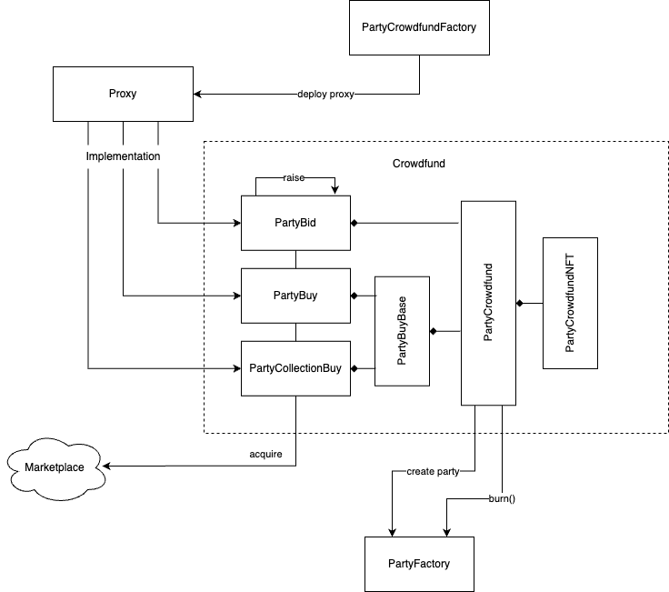

⚠️ *This document is incomplete/a work in progress!* ⚠️

# Crowdfund Contracts

These contracts allow people to create and join a crowdfund, pooling ETH together to acquire an NFT. Multiple crowdfund contracts exist for specific acquisition patterns.

## Key Concepts

- **Crowdfunds**: Contracts implementing various strategies that allow people to pool ETH together to acquire an NFT, with the end goal of forming a governance party around it.
- **Crowdfund NFTs**: A *soulbound* NFT (ERC721) representing contributions made to a crowdfund. Each contributor gets one of these the first time they contribute. At the end of the crowdfund (successful or unsuccessful), these are burned to either redeem unused ETH or mint governance shares.
- **Party**: The governance contract, which will be created and will custody the NFT after it has been acquired by the crowdfund.
- **Globals**: A single contract that holds configuration values, referenced by several ecosystem contracts.
- **Proxies**: All Crowdfund instances are deployed as simple [`Proxy`](../contracts/utils/Proxy.sol) contracts that forward calls to a specific crowdfund implementation that inherits from `PartyCrowdfund`.

## Contracts

The main contracts involved in this phase are:

- `PartyCrowdfundFactory`([source](../contracts/crowdfund/PartyCrowdfundFactory.sol))
    - Factory contract that deploys a new proxified `PartyCrowdfund` instance.
- `PartyCrowdfund` ([source](../contracts/crowdfund/PartyCrowdfund.sol))
    - Abstract base class for all crowdfund contracts. Implements most accounting and end-of-life logic for crowdfunds.  
- `PartyBuy` ([source](../contracts/crowdfund/PartyBuy.sol))
    - A crowdfund that purchases a specific NFT (i.e., with known token ID) listing for a known price.
- `PartyCollectionBuy` ([source](../contracts/crowdfund/PartyCollectionBuy.sol))
    - A crowdfund that purchases any NFT from a collection (i.e., any token ID) from a collection for a known price.
- `PartyBid` ([source](../contracts/crowdfund/PartyBid.sol))
    - A crowdfund that can repeatedly bid on an auction for a specific NFT (i.e., with known token ID) until it wins.
- `IMarketWrapper` ([source](../contracts/crowdfund/IMarketWrapper.sol))
    - A generic interface consumed by `PartyBid` to abstract away interactions with any auction marketplace.
- `IGateKeeper` ([source](../contracts/gatekeepers/IGateKeeper.sol))
    - An interface implemented by gatekeeper contracts that restrict who can participate in a crowdfund. There are currently two implementations of this interface:
        - `AllowListGateKeeper` ([source](../contracts/gatekeepers/AllowListGateKeeper.sol))
            - Restricts participation based on whether an address exist in a list.
        - `ERC20TokenGateKeeper` ([source](../contracts/gatekeepers/ERC20TokenGateKeeper.sol))
            - Restricts participation based on whether an address has a minimum balance of an ERC20.
- `Globals` ([code](../contracts/globals/Globals.sol))
    - A contract that defines global configuration values referenced by other contracts across the entire protocol.

