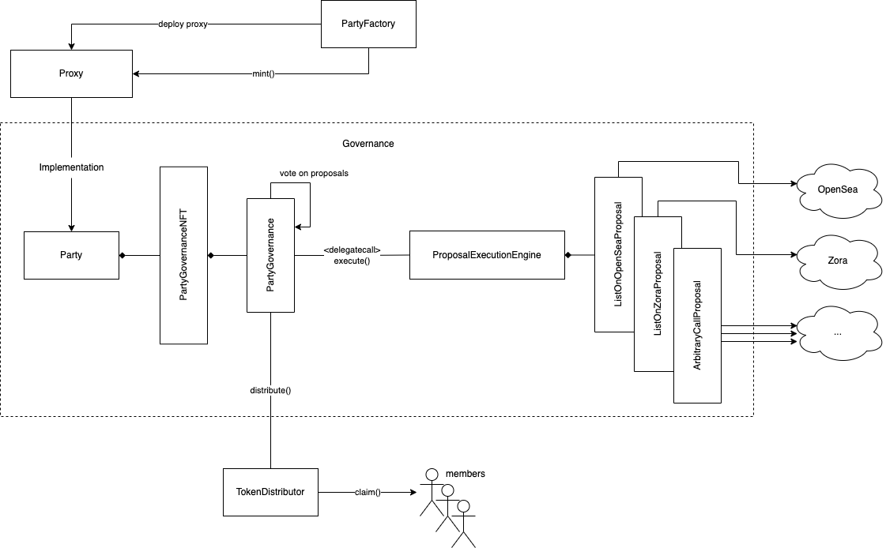

# Governance Contracts

After a crowdfund has acquired its NFTs, they transfer it to a governance `Party` around it, where the contributors are minted voting power equivalent to their contribution during the crowdfund and use that voting power to vote on proposals to be executed as the party.

## Key Concepts

- **Precious**: An NFT custodied by the governance contract (`Party`), conventionally acquired by the crowdfund phase. These are protected assets and are subject to extra restrictions in proposals vs other assets.
- **Voting Cards**: An NFT (721) representing voting power within the governance Party.
- **Party**: The governance contract itself, which custodies the NFT, tracks voting power, manages the lifecycle of proposals, and is simultaneously is the governance token (Voting Cards).
- **Proposals**: On-chain actions that will be executed as the party that must progress through the entire governance lifecycle (voting, etc).
- **Distributions**: An (ungoverned) mechanism by which parties can distribute ETH, ERC20, and ERC1155 tokens held by the party to members proportional to their relative voting power (voting cards).
- **Party Hosts**: Predefined accounts that can unilaterally veto proposals in the party. Conventionally defined when the crowdfund is created.
- **Globals**: A single contract that holds configuration values, referenced by several ecosystem contracts.
- **Proxies**: All `Party` instances are deployed as simple [`Proxy`](../contracts/utils/Proxy.sol) contracts that forward calls to a `Party` implementation contract.
- **ProposalExecutionEngine**: An upgradable contract the `Party` contract delegatecalls into that implements the logic for executing specific proposal types.  

## Contracts

The main contracts involved in this phase are:

- `PartyFactory` ([code](../contracts/party/PartyFactory.sol))
    - Creates new proxified `Party` instances.
- `Party` ([code](../contracts/party/Party.sol))
    - The governance contract that also custodies the precious NFTs. This is also the voting card 721 contract.
- `ProposalExecutionEngine` ([code](../contracts/proposals/ProposalExecutionEngine.sol))
    - An upgradable logic (and some state) contract for executing each proposal type from the context of the `Party`.
- `TokenDistributor` ([code](../contracts/distributions/TokenDistributor.sol))
    - Escrow contract for distributing deposited ETH, ERC20, and ERC1155 tokens to members of parties.
- `Globals` ([code](../contracts/globals/Globals.sol))
    - A contract that defines global configuration values referenced by other contracts across the entire protocol.



## Party Creation

### Sequence

Parties are created through the `PartyFactory` contract. This is typically automatically done
by a crowdfund instance after it wins, but it is also a valid use case to interact with the PartyFactory contract directly to, for example, form a governance party around an existing NFT.

The sequence of events is:

1. Call `PartyFactory.createParty()` defined as:
    ```solidity
    function createParty(
        address authority,
        Party.PartyOptions memory opts,
        IERC721[] memory preciousTokens,
        uint256[] memory preciousTokenIds
    )
    ```
    - `authority` will be the address that can mint tokens on the created Party (indirectly through `PartyFactory.mint()`). In typical flow, the crowdfund contract will set this to itself.
    - `opts` are (mostly) immutable [configuration parameters](#governance-options) for the Party, defining the Party name and symbol (the Party instance will also be an ERC721) and governance parameters.
    - `preciousTokens` and `preciousTokenIds` together define the NFTs the Party will custody and enforce extra restrictions on so they are not easily transferred out of the Party. This list cannot be changed after Party creation. Note that this list is never stored on-chain (only the hash is) and will need to be passed into the `execute()` call when executing proposals.
    - This will deploy a new `Proxy` instance with an implementation pointing to the Party contract defined by in the `Globals` contract by the key `GLOBAL_PARTY_IMPL`.
2. Transfer assets to the created Party, which will typically be the precious NFTs.
3. As the `authority`, mint voting cards to members of the party by calling `PartyFactory.mint()`.
    - In typical flow, the crowdfund contract will call this when contributors burn their contribution NFTs.
4. Optionally, call `PartyFactory.abdicate()`, as the `authority`, to revoke minting privilege once all voting cards have been minted.
5. At any step after the party creation, members with voting cards can perform governance actions, though they may not be able to reach consensus if the total supply of voting power hasn't been minted/distributed yet.

## Governance Options

Parties are initialized with fixed governance options which will (mostly) never change for the Party's lifetime. They are defined in the `PartyGovernance.GovernanceOpts` struct with the fields:

- `hosts`: Array of initial party hosts. This is the only configuration that can change because hosts can transfer their privilege to other accounts.
- `voteDuration`: Duration in seconds a proposal can be voted on after it has been proposed.
- `executionDelay`: Duration in seconds a proposal must wait after being passed before it can be executed. This gives hosts time to veto malicious proposals that have passed.
- `passThresholdBps`: Minimum ratio of votes vs `totalVotingPower` supply to consider a proposal passed. This is expressed in bps, i.e., 1e4 = 100%.
- `totalVotingPower`: Total voting power of the Party. This should be the sum of weights of all (possible) voting cards given to members. Note that nowhere is this assumption enforced, as there may be use-cases for minting more than 100% of voting power, but the logic in crowdfund contracts cannot mint more than `totalVotingPower`.
- `feeBps`: The fee taken out of this Party's [distributions](#distributions) to reserve for `feeRecipient` to claim. Typically this will be set to an address controlled by PartyDAO.
- `feeRecipient`: The address that can claim distribution fees for this Party.

## Voting Power

### Voting Cards
Voting power within the governance Party is represented and held by "voting cards," which are NFTs (721s) minted for each member of the Party. Each voting card has a distinct voting power/weight associated with it. These cards can never be broken up or combined, but a user may own multiple voting cards within a Party. The total (intrinsic) voting power a member has is the sum of all the voting power in all the voting cards for that Party they possess at a given timestamp.

### Delegation
Owners of voting cards can call `Party.delegateVotingPower()` to delegate their intrinsic *total* voting power (at the time of the call) to another account. The minter of the voting card can also set an initial delegate for the owner, meaning any voting cards held by the owner will be delegated by default. If a user transfers their voting card, the voting power will be delegated to the recipient's existing delegate.

The chosen delegate does not need to own a voting card. Delegating voting power strips the owner of their entire voting power until they redelegate to themselves, meaning they will not be able to vote on proposals created afterwards. Voting card owners can recover their voting power for future proposals if they delegate to themselves or to the zero address.

### Calculating Effective Voting Power
The effective voting power of a user is the sum of all undelegated (or self-delegated) voting power from their voting cards plus the sum of all voting power delegated to them by other users.

The effective voting power of a user at a given time can be found by calling `Party.getVotingPowerAt()`.

### Voting Power Snapshots
The voting power applied when a user votes on a proposal is their effective voting power at the time the proposal was proposed. This prevents people from acquiring large amounts of voting cards to influence the outcome of an active proposal. The `Party` contract appends a record of a user's total delegated (to them) and intrinsic voting power each time any of the following occurs:

- A user receives a voting card (transfer or minting).
- A user transfers their voting card to another user.
- A user (un)delegates their voting power.
- A user gets voting power (un)delegated to them.

When determining the effective voting power of a user, we binary search a user's voting power records for the most recent record <= the proposal time.

## Distributions

TODO:
- What they are and how to trigger one
- How they're created (call sequence)
    - Off-chain storage
- How to claim
- Fees
- Emergency backdoors

## Governance Lifecycle

Governance in Parties follows a fairly traditional model, revolving around passing and executing proposals. Proposals have the following properties:

- proposal ID: A unique identifier (counter) assigned to a proposal when it it is first proposed.
- `maxExecutableTime`: A timestamp beyond which the proposal can no longer be executed (for the first time).
- `minCancelTime`: A timestamp beyond which the proposal can be forcibly interrupted and marked complete so another proposal can be executed.
- `proposalData`: Encoded data needed to execute the proposal.

An important thing to note is that none of these proposal properties are ever stored on-chain. Instead, only the hash of these fields are stored on-chain (keyed by the proposal ID) to enforce that the properties do not change between lifecycle operations.

### Proposal Stages/Status

The stages of a proposal are defined in `PartyGovernance.ProposalStatus`:

- `Invalid`: The proposal does not exist.
- `Voting`: The proposal has been proposed (via `propose()`), has not been vetoed by a party host, and is within the voting window. Members can vote on the proposal and party hosts can veto the proposal.
- `Defeated`: The proposal has either exceeded its voting window without reaching `passThresholdBps` of votes or was vetoed by a party host.
- `Passed`: The proposal reached at least `passThresholdBps` of votes but is still waiting for `executionDelay` to pass before it can be executed. Members can continue to vote on the proposal and party hosts can veto at this time.
- `Ready`: Same as `Passed` but now `executionDelay` has been satisfied. Any member may execute the proposal via `execute()`, unless `maxExecutableTime` has arrived.
- `InProgress`: The proposal has been executed at least once but has further steps to complete so it needs to be executed again. No other proposals may be executed while a proposal is in the `InProgress` state. No voting or vetoing of the proposal is allowed, however it may be forcibly cancelled via `cancel()` if the `minCancelTime` has arrived.
- `Complete`: The proposal was executed and completed all its steps. No voting or vetoing can occur and it cannot be cancelled nor executed again.

### Making Proposals

A proposer should choose an appropriate `maxExecutableTime` and `minCancelTime`. The `proposalData` should be prefixed (like a function call) with a 4-byte `IProposalExecutionEngine.ProposalType` value followed by the ABI-encoded data specific to that proposal type (see [Proposal Types](#proposal-types)), e.g., `abi.encodePacked(uint32(IProposalExecutionEngine.ProposalType.ListOnZoraProposal), abi.encode(ZoraProposalData(...)))`.

Once ready, an active member or delegate (someone with nonzero effective voting power) can call `propose()` with the proposal properties, which will assign a unique, nonzero proposal ID and put the proposal in the `Voting` status. Proposing a proposal will also automatically cast the proposer's votes for it.

### Voting on Proposals

Any proposal in the `Voting`, `Passed`, or `Ready` status can be voted on by members and delegates via `Party.accept()`. The `accept()` function casts the caller's *total* effective voting power at the time the proposal was proposed for it. Once the total voting power cast for the proposal meets or exceeds the `passThresholdBps` ratio, given by `total cast voting power / totalVotingPower`, the proposal will enter the `Passed` state.

Members can continue to vote even beyond the `Passed` state in order to achieve a unanimous vote, which unlocks specific behavior for certain proposal types. A unanimous vote condition is met when 99.99% of `totalVotingPower` has been cast for a proposal. We do not check for 100% because of possible rounding errors during minting from crowdfunds.

### Vetoes

During the `Voting`, `Passed`, and `Ready` phases of a proposal, a Party host may unilaterally veto that proposal by calling `Party.veto()`, immediately putting the proposal in the `Defeated` state. At that point, no further action can be taken on the proposal.

The rationale behind the veto power that if voting power in a Party becomes so consolidated that a bad actor can pass a malicious proposal, the party host can act as the final backstop. On the other hand, a party host can also stall a Party by vetoing every legitimate proposal, so Parties need to be extremely careful with who they agree to be hosts.

### Executing Proposals

After a proposal has achieved enough votes to pass and the `executionDelay` window has expired, the proposal can be executed by any member with currently nonzero effective voting power. This occurs via the `Party.execute()` function.

The call to `execute()` will fail if:
- The proposal has already been executed and completed (in the `Complete` status).
- The proposal has not been executed but its `maxExecutableTime` has passed.
- The proposal's execution reverts.
- There exists another proposal that has been executed but did not complete (more steps to go).

If the proposal is atomic, meaning it is a single-step proposal, it will immediately enter the `Complete` status.

#### Multi-step Proposals
Some proposal types require multiple steps and transactions to be completed. An example is the `ListOnZoraProposal` type. This proposal will first list an NFT on Zora as an auction then if the auction does not receive any bids after some amount of time or if the auction completes with a winning bid, the auction will need to be cancelled or finalized by the Party. To accomplish this, the proposal must be executed multiple times until it is considered complete and can enter the `Complete` status.

Usually further steps in a multi-step proposal requires some state to be remembered between steps. For example, the `ListOnZoraProposal` type will need to recall the ID of the Zora auction it created so it can cancel or finalize it as a final step. Rather than storing this (potentially complex) data on-chain, executing a proposal will emit a `ProposalExecuted` event with an arbitrary bytes `nextProgressData` parameter, which should be passed into the next call to `execute()` to advance the proposal. The `Party` will only store the hash of the `nextProgressData` and confirm it matches the hash of what is passed in. This data blob holds any encoded state necessary to progress the proposal to the next step.

Once the proposal has executed its final step, it will emit an empty `nextProgressData` in the `ProposalExecuted` event.

### Cancelling Proposals
There is a risk of multi-step proposals never being able to complete because they may continue to revert. Since no other proposals can be executed if another proposal is `InProgress`, a Party can become permanently stuck, unable to execute any other proposal. To prevent this scenario, proposals have a `minCancelTime` property, after which an `InProgress` proposal can be forced into a `Complete` state. There is also a global (defined in the `Globals` contract) configuration value (`GLOBAL_PROPOSAL_MAX_CANCEL_DURATION`) which limits the `minCancelTime` to a time not too far in the future.

Cancelling a proposal should be considered a last resort, as it can potentially leave the Party in a broken state (e.g., assets are stuck in another protocol) because the proposal was not able to properly clean up after itself. With this in mind, Parties should be careful not to pass proposals that have too soon a `minCancelTime` unless they fully trust all other members.

## The ProposalExecutionEngine

TODO:
- Rationale
- Single execution enforcement
- Progress data enforcement
- Upgrades

## Proposal Types

### ListOnOpenSea Proposal Type

TODO:
- Proposal properties
- Steps
    - Create zora auction
    - Cancel/Finalize zora auction
    - Create OS listing
    - Finalize OS listing
- Behavior when unanimous

### ListOnZora Proposal Type

TODO:
- Proposal properties
- Steps
    - Create zora auction
    - Cancel/Finalize zora auction

### Fractionalize Proposal Type

...

### ArbitraryCalls Proposal Type

TODO:
- Proposal/Call properties
- Restricted operations
- Behavior when unanimous
- Attaching ETH

### UpgradeProposalEngineImpl Proposal Type

TODO:
- Proposal properties (none)
- Use of Global
- Security concerns
    - Bricking parties

## Emergency Backdoors

TODO:
- Rationale
- Revoking
