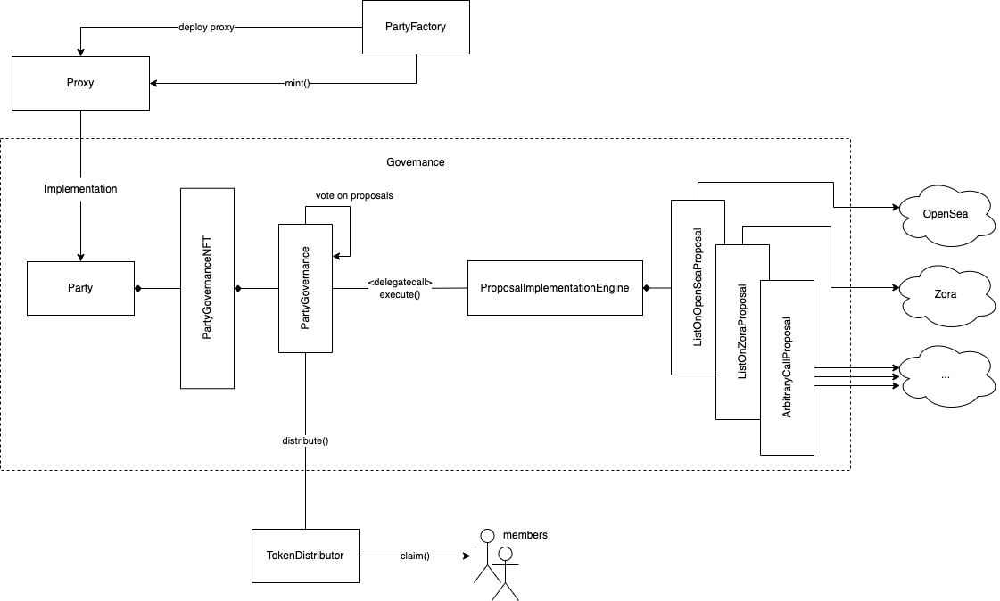

# Governance Contracts

In this phase, a crowdfund contract is deployed for people to pool together ETH in order to raise enough to acquire an NFT. The specific kind of crowdfund contract deployed will restrict the kind of actions a party can carry out to acquire the NFT.

## Concepts

- Crowdfund
    -
- Party
    -
- Distributions
    -
- Voting Cards
    -
- Proposals
    -
- Globals
    -
- Proxies
    -
- Upgradeability
    -

## Contracts

The main contracts involved in this phase are:

- [`PartyFactory`](./PartyFactory.md) ([source](../contracts/crowdfund/PartyCrowdfundFactory.sol))
    - The main contract
- [`Party`](./Party.md) ([source](../contracts/crowdfund/PartyBuy.sol))
    - ...
- [`ProposalImplementationEngine`](./ProposalImplementationEngine.md) ([source](../contracts/crowdfund/PartyCollectionBuy.sol))
    - ...
- [`TokenDistributor`](./TokenDistributor.md) ([source](../contracts/crowdfund/PartyBid.sol))
    - ...
- [`Globals`](./Globals.md) ([source](../contracts/gateKeepers/IGateKeeper.sol))
    - ...

1. Someone deploys a new
## Governance Phase
- The crowdfund phase which is driven through a new instance of:
    - [`PartyBid`](../contracts/crowdfund/PartyBid.sol): Where users pool ETH together to bid on a specific 721 being auctioned.
    - [`PartyBuy`](../contracts/crowdfund/PartyBuy.sol): Where users pool ETH together to buy a specific 721 for a fixed price.
    - [`PartyCollectionBuy`](../contracts/crowdfund/PartyCollectionBuy.sol): where users pool ETH together to buy **any** token from a 721 for a fixed price.
- The governance phase, which is always a new instance of `Party`.
    - The `Party` contract custodies the acquired NFT and

## Contract Architecture
