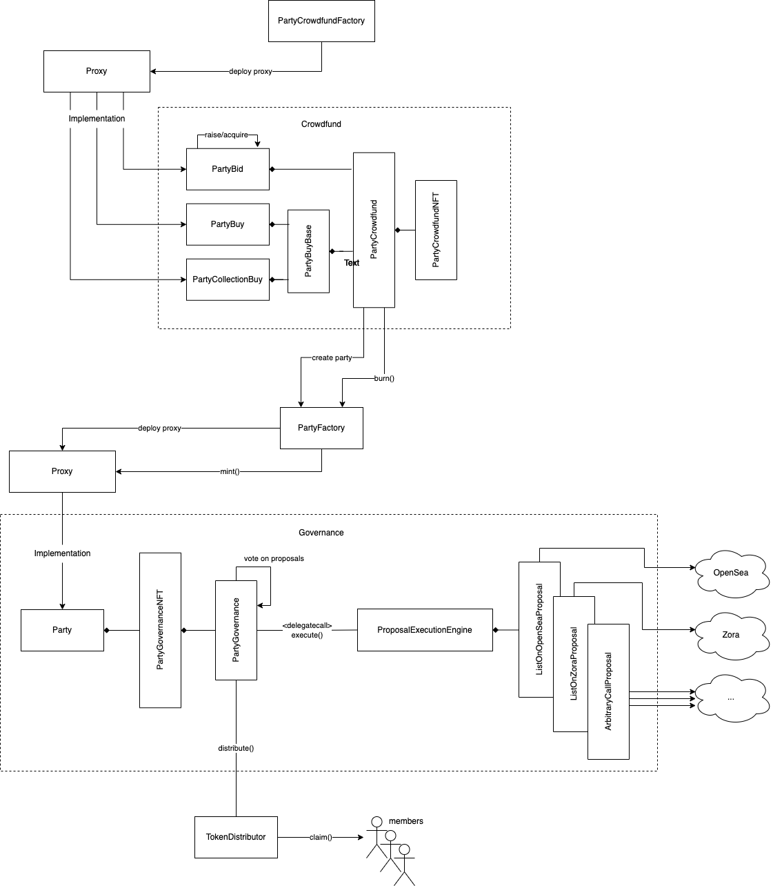

# Party Protocol

The Party protocol allows people to pool funds together to acquire NFTs then govern those NFTs together.

## Phases

The protocol has two distinct phases that occur in this order:

- [Crowdfund](./crowdfund.md)
    - Where contributors pool together ETH to acquire an NFT.
- [Governance](./governance.md)
    - Where contributors govern an NFT (typically acquired by a crowdfund).

## Protocol Lifecycle

